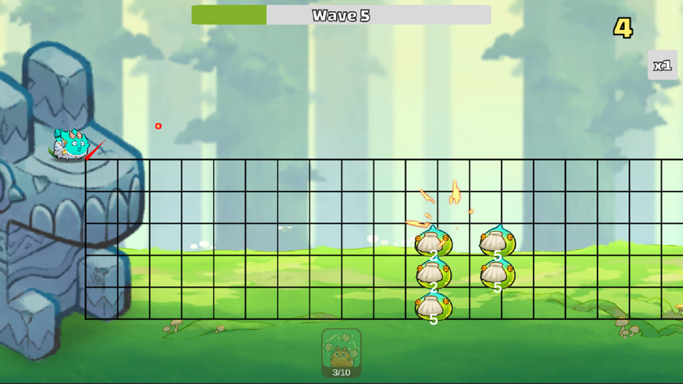

# UNITY TEST: AXIE GAME 02

## About Axie Infinity

Axie Infinity is a virtual world filled with cute, formidable creatures known as Axies. Axies can be battled, bred, collected, and even used to earn resources & collectibles that can be traded on an open marketplace.
Axie was designed to introduce the world to an exciting new technology called Blockchain, through a fun, nostalgic, & charming game.

## The Challenge Begins

### Introduction

One day, huge waves of monsters unexpectedly attacked our Axies' village. As an outpost watcher (and also a cute Axie), your mission is to eliminate as many of them as possible.

You can stop these monsters by throwing "fireballs". At least this will cause damages and stop some (or all) of them. 

In order to throw these "fireballs", you must calculate 2 parameters:

- **Angle** (in degrees)
- **Power**

Sounds like an artillery-style game, doesn't it?

> **Notes**:
>  
> - You earn points for each monster wiped out, but lose points for each one passed.
> - **Special Shot**: after each 10 eliminated monster, your next throws is empowered (play the game to see more).

### How to implement your scripts

You will be working with the **`AIController.cs`** script located at `Assets/Scripts/GameDefense/Controllers/AIController.cs` to improve the precision of your throws. 

We appreciate any intelligent methods, but degrade any cheating.

### Restrictions

For evaluation, we use only your **`AIController.cs`** file with our pure project. Editing other files in your project is not recommended, as it may create more risks than benefits.

### Submission
To submit, only upload the **`AIController.cs`** file into the submission page.

### Deadline
This test is designed for 5 - 10 hours of coding. We know you might be busy with your current work, the maximum deadline is 7 days after you received this test.

## Good luck! 

